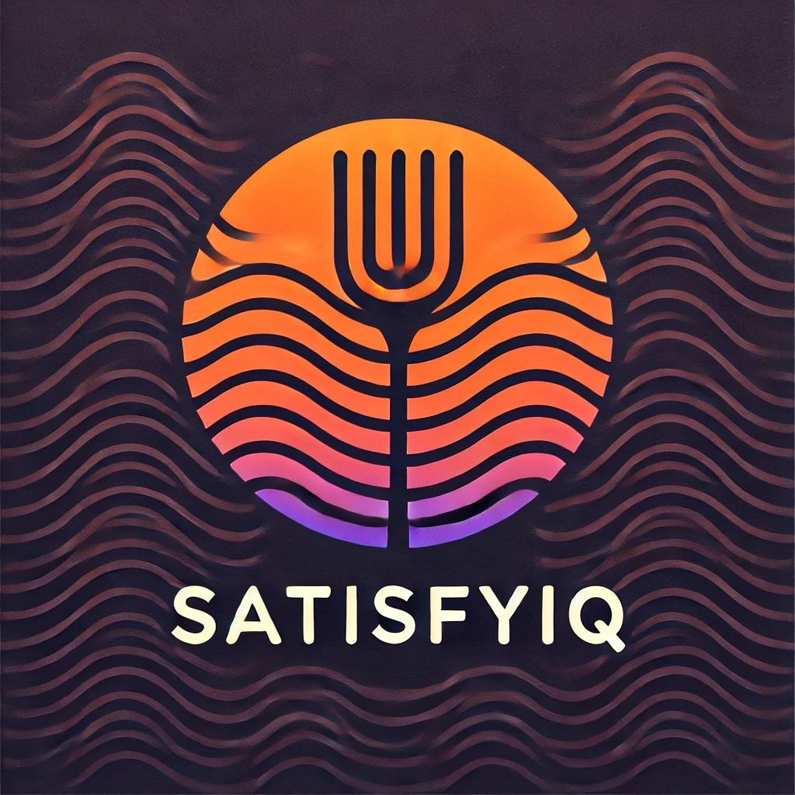

## <h1 align="center"><b><i>SatisfyIQ</i></b></h1> 

  

## :eight_spoked_asterisk: **_Sobre nosotros_**

En **SatisfyIQ**, nos especializamos en ayudar a los restaurantes a mejorar su desempeño y reputación mediante el análisis de reseñas y calificaciones de clientes. Ofrecemos a los restaurantes las herramientas necesarias para entender a fondo lo que piensan sus clientes, identificar áreas de mejora, y aprovechar una ventaja competitiva al comparar su rendimiento con el de sus principales competidores.

Nuestro enfoque está basado en datos, lo que permite a los restaurantes tomar decisiones informadas y estratégicas que impactan directamente en la satisfacción del cliente. En **SatisfyIQ**, creemos que una reputación sólida y un servicio optimizado son las claves del éxito en la industria gastronómica.

## :eight_spoked_asterisk: **_Cliente Objetivo_**

Nuestro cliente ideal es un restaurante ubicado en Florida, que busca optimizar su desempeño y reputación en línea. Son negocios que desean entender mejor cómo los perciben sus clientes, gestionar de manera eficiente sus reseñas, y obtener una ventaja competitiva frente a sus principales competidores. Estos restaurantes están interesados en mejorar su calificación general, aumentar las reseñas positivas y ajustar sus estrategias para alinearse mejor con las expectativas de sus comensales.

## :eight_spoked_asterisk: **_Objetivo General_**

El objetivo general de **SatisfyIQ** es proporcionar a los restaurantes en Florida, herramientas y análisis basados en datos que les permitan mejorar su desempeño, optimizar la gestión de reseñas y aumentar la satisfacción del cliente. A través de informes detallados y comparaciones con la competencia, buscamos ayudar a los restaurantes a tomar decisiones estratégicas que impulsen su éxito en un mercado altamente competitivo.

## :eight_spoked_asterisk: **_Objetivos Especificos_**

**1.** Proporcionar informes detallados sobre el desempeño de los restaurantes, analizando reseñas y calificaciones para identificar áreas de mejora y puntos fuertes.

**2.** Consolidar y centralizar todas las reseñas de diversas plataformas (Yelp, Google, etc.) en un unico dashboard, facilitando su lectura y gestión para los restaurantes.

**3.** Ofrecer comparaciones estratégicas con los principales competidores, mostrando cómo se posiciona el restaurante en el mercado y qué ajustes realizar para mejorar su rendimiento.

**4.** Identificar tendencias clave en las preferencias de los clientes mediante el análisis de comentarios, lo que permite a los restaurantes adaptar sus menús, servicios y estrategias de marketing.

**5.** Optimizar la respuesta a reseñas negativas y positivas, ayudando a los restaurantes a mejorar la interacción con los clientes y aumentar su reputación en línea.

**6.** Desarrollar estrategias basadas en datos que permitan a los restaurantes incrementar su calificación positiva y reducir las reseñas negativas de manera consistente.

**7.** Monitorear el progreso del restaurante a lo largo del tiempo, ofreciendo métricas clave que permitan una mejora continua y sostenida en su reputación y servicio.

## :eight_spoked_asterisk: **_Alcance_**

El alcance de **SatisfyIQ** abarca la recopilación, análisis y presentación de datos de reseñas y calificaciones de clientes para restaurantes en Miami, Florida. Nos enfocamos en consolidar todas las opiniones de plataformas como Yelp y Google en una sola herramienta fácil de usar, facilitando la gestión y el monitoreo continuo del desempeño del restaurante. Además, proporcionamos informes detallados que identifican fortalezas y áreas de mejora, permitiendo a los restaurantes ajustar sus estrategias en función de la retroalimentación de los clientes.

## :eight_spoked_asterisk: **_Justificacion_**

La competitividad en el sector de la restauración en Florida exige que los restaurantes gestionen eficazmente su reputación y rendimiento. Las reseñas y calificaciones de los clientes son una fuente valiosa de retroalimentación, y en **SatisfyIQ** ofrecemos una plataforma que consolida todas las reseñas, facilitando su análisis. Con nuestros informes detallados, ayudamos a los restaurantes a identificar áreas de mejora clave y tomar decisiones basadas en datos, lo que aumenta la satisfacción del cliente y mejora de forma orgánica la visibilidad de los restaurantes en plataformas digitales.

Además, **SatisfyIQ** proporciona una ventaja competitiva al comparar el desempeño de cada restaurante con el de sus principales competidores. Esto permite a nuestros clientes ajustar sus estrategias en función de las tendencias del mercado y las preferencias del consumidor. Nuestra plataforma no solo optimiza la eficiencia operativa, sino que también mejora la experiencia del cliente, ayudando a los restaurantes a sobresalir en un mercado cada vez más competitivo.

## :eight_spoked_asterisk: **_Key performance indicators (Kpis)_**

**:one:_Kpi:_ Ranking de Desempeño del Restaurante por Reseñas** 

Este KPI proporciona un ranking que indica la posición de un restaurante en comparación con otros, basado en el número total de reseñas y la calificación promedio. Este puntaje no solo refleja la cantidad de opiniones recibidas, sino que también considera la calidad de dichas reseñas. Así, los restaurantes pueden entender mejor su desempeño relativo en el mercado y cómo pueden mejorar su visibilidad sostenido por una linea temporal.

**Fórmula**:(Promedio de Calificación * Peso1) + (Número de Reseñas * Peso2)

Este KPI también permite monitorear cómo ha cambiado la posición del restaurante en el ranking en un período de tiempo específico, como un mes. Por ejemplo, si un restaurante bajó 3 posiciones en el ranking respecto al mes anterior, esto indica que su puntaje ha disminuido en relación a otros restaurantes. Este cambio puede ser un signo de la necesidad de ajustar estrategias para mejorar tanto la calidad como la cantidad de reseñas.

**:two:_Kpi:_ Tasa de Variación en Sentimientos de Reseñas** 

Este KPI mide la variación porcentual en el número de reseñas por sentimiento (positivas, negativas y neutrales) entre dos períodos de tiempo. Proporciona una visión clara de cómo ha cambiado la percepción del restaurante en la opinión de los clientes. Esto permite evaluar si las estrategias implementadas están impactando positivamente la satisfacción del cliente o si hay áreas que requieren mayor atención.

**Fórmula**:
((Número de Reseñas del Período Actual - Número de Reseñas del Período Anterior) / Número de Reseñas del Período Anterior) * 100

**:three:_Kpi:_ Tasa de Crecimiento de Reseñas** 

Este KPI mide el crecimiento o decrecimiento en la cantidad de reseñas recibidas por un restaurante en un período específico. Es útil para monitorear el interés de los clientes y el nivel de interacción con el negocio, lo que permite identificar si las estrategias de marketing y satisfacción están siendo efectivas para atraer reseñas.

**Fórmula**:((Numero de reseñas del periodo actual - numero de reseñas de periodo anterior)/numero de reseñas del periodo anterior)*100

**:four:_Kpi:_ Ratio de Interacción de Reseñas** 

Mide cuántas reseñas se respondieron dentro de un período específico. Esto puede ayudar a evaluar la proactividad del restaurante en la atención al cliente.

**Fórmula**: (numero de reseñas respondidas/ numero total de reseñas) * 100

## :eight_spoked_asterisk: **_Entregables_**

**Sprint 1:** En este primer sprint, nos enfocaremos en implementar un proceso de extracción, transformación y carga (ETL) para recopilar y estructurar datos de reseñas de restaurantes de plataformas como Yelp y Google. Posteriormente, realizaremos un análisis exploratorio de datos (EDA) para identificar tendencias, correlaciones y patrones relevantes, lo que nos permitirá obtener insights sobre la satisfacción del cliente y la calidad del servicio.

Además, desarrollaremos una idea de negocio que utilice estos insights para ayudar a los restaurantes a mejorar su oferta y atraer más clientes. Se definirán indicadores clave de desempeño (KPIs). Al finalizar este sprint, tendremos una base sólida para futuras decisiones estratégicas y mejoras en el servicio.

## :eight_spoked_asterisk: **_Pipeline y Stack tecnologico_**

## :eight_spoked_asterisk: **_Dashboard_**

## :eight_spoked_asterisk: **_Conclusiones_**

## :green_book: **_Datasets_**

**🔗Link Data yelp:** https://drive.google.com/drive/folders/1TI-SsMnZsNP6t930olEEWbBQdo_yuIZF

**🔗Link Data google:** https://drive.google.com/drive/folders/1Wf7YkxA0aHI3GpoHc9Nh8_scf5BbD4DA
